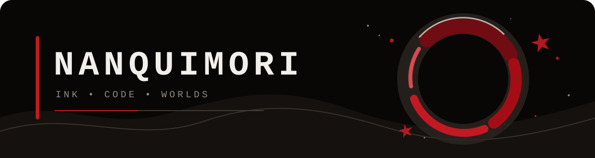
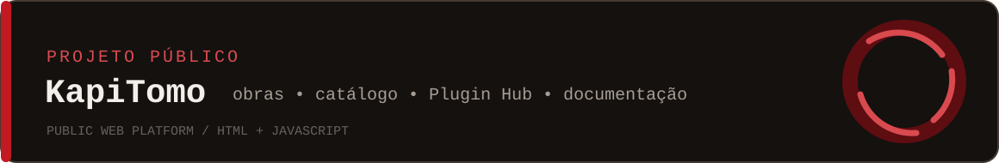
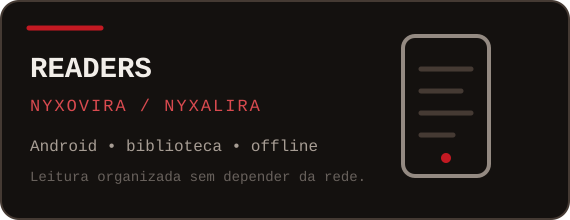
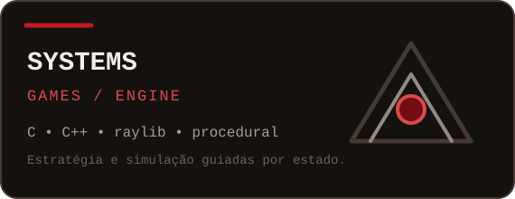

  

  
  

<h3 align="center">Construindo experiências onde nanquim encontra código.</h3>

  Leitores Android, ferramentas abertas, jogos sistêmicos e interfaces com identidade própria. 
  Android readers, open tools, systemic games and interfaces with a distinct visual language.

---

### Sobre

Nanquimori é meu espaço de criação independente. Desenvolvo software com foco em sistemas conectados, leitura offline, ferramentas para conteúdo e experiências interativas construídas com cuidado técnico e visual.

> **Forma antes do ruído. Sistemas antes do verniz.**

### Trabalho em destaque

  

  
  

### Ferramentas e linguagens

  
  
  
  
  
  
  
  

### Princípios

- **Offline quando importa:** o conteúdo do usuário deve continuar acessível.
- **Sistemas de verdade:** cada tela deve refletir o mesmo estado, sem cenários decorativos desconectados.
- **Interfaces com personalidade:** clareza e atmosfera podem existir juntas.
- **Ferramentas abertas:** documentação e formatos compreensíveis tornam projetos mais duráveis.

### Em construção

- Evolução do **KapiTomo**, seu catálogo público e a documentação para criadores de plugins.
- Leitura organizada no Android com **Nyxovira** e **Nyxalira**.
- Estratégia, simulação e renderização procedural em projetos C, C++ e raylib.

  

  Feito com tinta escura, detalhes carmim e código legível.

